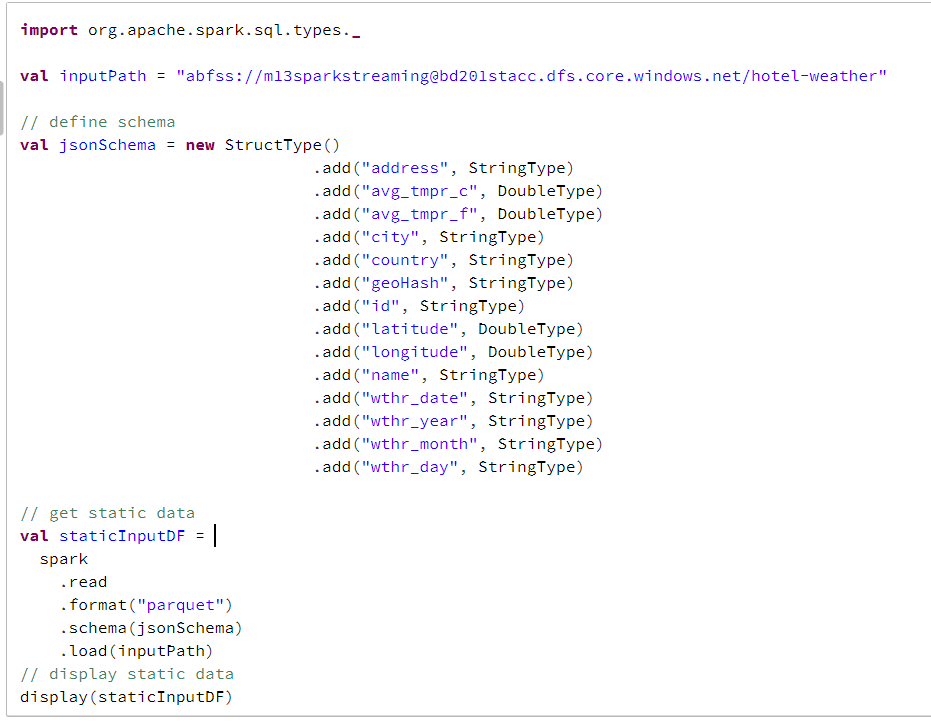
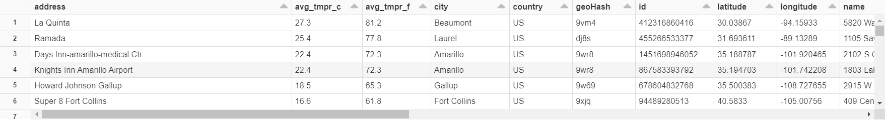
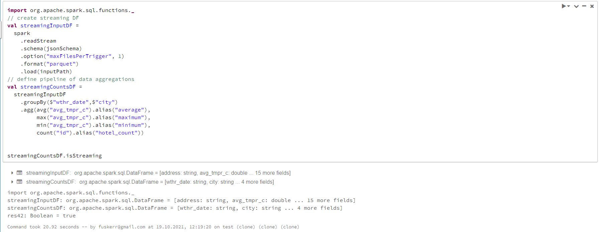
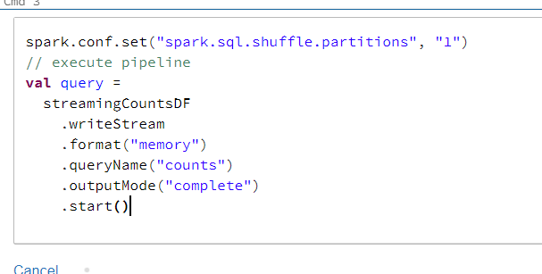
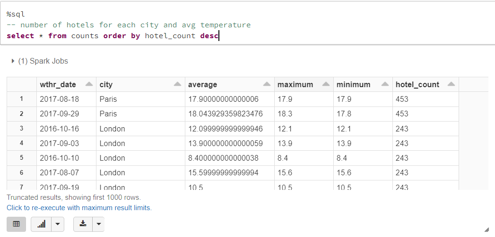
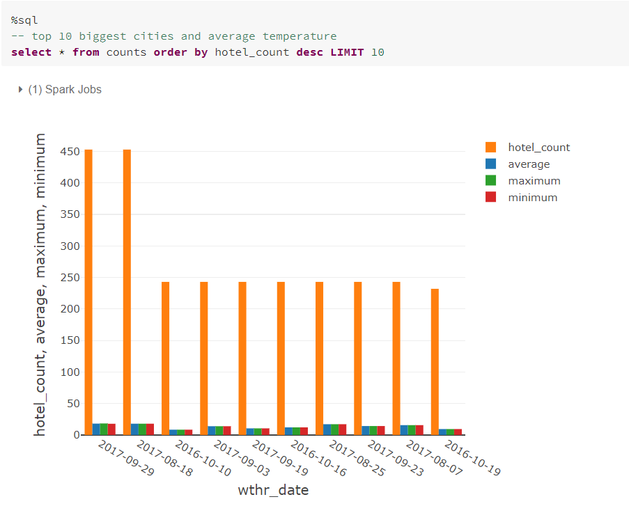

notebook: https://databricks-prod-cloudfront.cloud.databricks.com/public/4027ec902e239c93eaaa8714f173bcfc/1110898147263191/4499549994427065/3074950375819508/latest.html

* Add your code in `src/main/` if needed
* Test your code with `src/tests/` if needed
* Modify notebooks for your needs
* Deploy infrastructure with terraform
```
terraform init
terraform plan -out terraform.plan
terraform apply terraform.plan
....
terraform destroy
```
* Launch notebooks on Databricks cluster

Define schema and display raw data


result:


Create streaming dataframe and define pipeline


Execute pipeline


Here we can see number of distinct hotel and average temp for each city each day


And here is visualized data for 10 biggest cities
